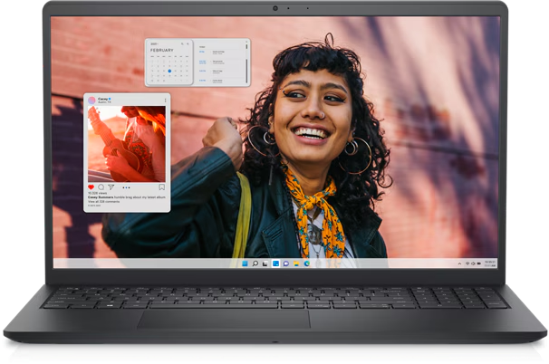

# Projeto de Modernização Tecnológica: Aquisição de Notebooks para a Escola.
 ## 1. Identificação do Projeto - **Nome do Projeto:** Modernização Tecnológica da EEMTI Custódio da Silva Lemos - **Instituição:** Escola Municipal EEMTI Custódio da Silva Lemos - **Responsável Técnico:** Francisco Welton da Silva - **Data:** 21 de agosto de 2025

## 1. Resumo Executivo
A escola atualmente utiliza computadores antigos e limitados, dificultando a aprendizagem e a mobilidade dos alunos. Este projeto propõe a aquisição de 30 notebooks modernos, que permitirão maior flexibilidade, mobilidade e eficiência no ensino, além de reduzir custos de manutenção e consumo de energia. A iniciativa visa modernizar a infraestrutura tecnológica e ampliar as oportunidades de aprendizagem.

## 2. Introdução e Justificativa
Atualmente, os computadores disponíveis na escola encontram-se obsoletos, com baixo desempenho e restritos ao uso em laboratórios fixos. Essa situação gera dificuldades no processo de ensino-aprendizagem e limita a exploração de metodologias inovadoras.  
A aquisição de notebooks permitirá maior dinamismo nas aulas, acesso a diferentes ambientes da escola, possibilidade de atividades em campo e melhor aproveitamento dos recursos digitais. Além disso, notebooks oferecem vantagens sobre desktops, como mobilidade, menor consumo de energia e praticidade de manutenção.

## 3. Objetivos
- Promover mobilidade e flexibilidade no uso dos recursos computacionais.  
- Reduzir em 20% o consumo de energia elétrica em comparação aos desktops atuais.  
- Aumentar em 30% a utilização dos equipamentos em diferentes espaços da escola.  
- Modernizar a infraestrutura tecnológica e preparar o ambiente escolar para metodologias ativas de ensino.  

## 4. Especificações Técnicas dos Notebooks

| Componente      | Mínimo            | Recomendado       |
|-----------------|------------------|------------------|
| Processador     | Intel i5 11ª Geração | Intel i7 12ª Geração |
| Memória RAM     | 8 GB              | 16 GB             |
| Armazenamento   | SSD 256 GB        | SSD 512 GB        |
| Sistema Operacional | Windows 11 Educacional | Windows 11 Pro |
| Tela            | 14” Full HD       | 15,6” Full HD     |
| Bateria         | 6 horas           | 10 horas          |
| Conectividade   | Wi-Fi 6, Bluetooth 5.0 | Wi-Fi 6E, Bluetooth 5.2 |
| Portas          | USB 3.0, HDMI     | USB-C, USB 3.1, HDMI |

**Figura 1 – Modelo ilustrativo de notebook educacional** 
 
(https://upload.wikimedia.org/wikipedia/commons/3/3a/Dell_Inspiron_15.png)

Links de Referência:  
- [Dell Inspiron Educacional](https://www.dell.com)  
- [Benefícios da Mobilidade Acadêmica](https://www.microsoft.com/education)

## 5. Orçamento Estimado

| Item                         | Quantidade | Valor Unitário (R$) | Valor Total (R$) |
|------------------------------|------------|---------------------|------------------|
| Notebook                     | 30         | 5.500,00            | 165.000,00       |
| Seguro contra acidentes (1 ano) | 30         | 400,00              | 12.000,00        |
| Sistema de rastreamento/licença | 30         | 200,00              | 6.000,00         |
| Licenças de Software (Pacote Educacional) | 30 | 300,00              | 9.000,00         |
| Bolsas/Cases de proteção     | 30         | 150,00              | 4.500,00         |
| Roteador Wi-Fi (laboratório) | 2          | 800,00              | 1.600,00         |
| Instalação e Configuração Inicial | 1    | 5.000,00            | 5.000,00         |
| **TOTAL GERAL ESTIMADO**     |            |                     | **203.100,00**   |

## 6. Benefícios Esperados
- Aulas em diferentes espaços da escola e em atividades externas.  
- Melhor aproveitamento dos recursos digitais e metodologias ativas.  
- Redução no consumo de energia e nos custos de manutenção.  
- Maior inclusão digital para alunos e professores.  
- Infraestrutura moderna e alinhada às demandas da educação atual.  

## 7. Cronograma Simplificado

| Etapa                  | Prazo Estimado |
|-------------------------|----------------|
| Planejamento            | 2 semanas      |
| Aquisição dos notebooks | 3 semanas      |
| Instalação e Configuração | 2 semanas    |
| Implantação e Treinamento | 2 semanas    |

## 8. Considerações Finais
A aquisição dos notebooks representa um passo estratégico para modernizar a infraestrutura escolar, aumentar a eficiência do processo de ensino-aprendizagem e preparar a instituição para os desafios da educação digital. O investimento proposto é viável, traz benefícios diretos e indiretos e fortalece o compromisso da escola com a inovação tecnológica.

